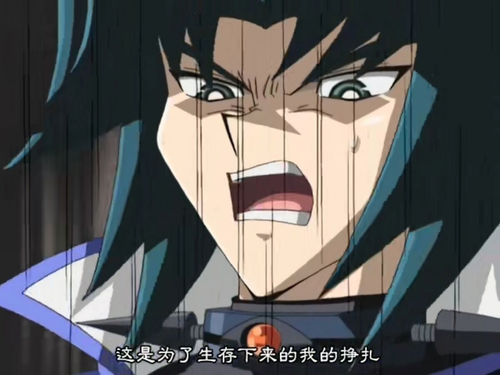

## 前言

大學這幾年呢，要是能夠讀自己會喜歡也有辦法一直持續下去的東西就好了。但做決定總是沒辦法用未來的資訊來輔助，因而總是會有人不小心讀了一個可能不適合做為往後生涯所用的科系。在我看來，可能不是那麼多人都能夠下定決心直接選擇換個領域，因為這意味著之前所花的時間白費了。其實以前在思考要不要踏出這步的時候，上網搜尋到的相關資訊其實不算很多，不是指數量不多，而是千篇一律，拿著跨資訊領域餵給google就都是跨考研究所。但出於莫名抗拒考試的原因~~其實就是覺得考研浪費生命~~，覺得還是可以另闢蹊徑達到目標，這篇就是講述了為什麼我要選這種方法、如何規劃到怎麼實現推甄上資工所這個中期目標的整個流程。看到先前的成功例子，應該會讓人增加點信心吧，至少我是這樣覺得的，也因此就想寫這篇了，算是一個濃縮紀錄吧，太長也看不完。

其實我覺得這個主題還是比修課心得什麼的會更有內容一點，修課的東西有些都淡忘了，但就是這一路上的感受倒是沒有減弱多少。我希望能夠盡力的寫得不要太流水帳，可惜了我的文筆就是從小到大都一樣爛，也許會分個幾段方便閱讀吧，五年的東西應該、也許還是有不少感想可以寫的。整篇文會講述背景、我認為某些重要的轉折點或決定，到我現在看覺得也許還能改進什麼之類的，又或是一些心境上的感想。這篇文理論上也只講課業，要說有沒有其他部分嘛...，顧課業於我而言尚且分身乏術，何況其他 "大學必修學分" 呢。

順帶一提，我先前推甄剛上了沒多久有在 Dcard 研究所板上面發了一篇文，一篇推甄心得 [原文連結](https://www.dcard.tw/f/graduate_school/p/257312387?cid=a346a6ef-6d71-41a4-82eb-e3b17e11bfd4)，原意其實就是想做個小實驗嘛。至於是實驗什麼，過去這個版上其實還沒有跨推到台大資工正所的心得，多半跨推心得也是往下面學校推的，所以我就想看這樣的背景與成果會被怎麼評論。雖然結果不出我所料，有單純覺得不錯的，還有就是來陰陽怪氣的，而且這些流言愛心還特多。是啊，雖然這個版嗜血的酸民不少這件事我早就知道了，但多少還是會介意，但我後來的心境就變成 ~~名額搶不過外系的本系還是乖乖去考研~~，雖然不好但有用。

## 為什麼大學選了化學系讀而不是其他系

這個起點是怎麼來的呢，我自認自己選科系的方法不算特別好但是常見的，應該大多數高中生也是這樣。就是簡單粗暴的從高中科目裡挑那幾個自己讀得順手或看得順眼的，或是刪去自己討厭的科目。最後再加點現實的因素進去，不外乎這個科系以後工作好不好找、薪水高不高。在高中時期，對我而言，科目排行大概是這個樣子：

- 化學
- 地科
- 數學
- 物理
- 生物

雖然讀的是三類組，但我其實蠻早就覺得自己的個性和志趣完全不在醫牙科系上，物理讀的不是很順手也被我往後排。這樣過後那就剩什麼了，地科相關科系被現實因素給否決掉了，那就化學吧，正好這時候覺得做做小實驗還挺有趣的，所以就選了化學系讀。

現在看來，覺得自己選科系是稍微隨便了一點，但以現在看來應該仍然不算什麼大錯誤決定。當時有錄取的系有化學、大氣和化工系，至少我現在看來避開化工就讓這個決定有不錯的價值了。為什麼這麼說，有兩個部分，一個是我在填志願之前仔細研究了一下化工系，發現是物理為重，讀的一定是更痛苦；另外一點是化工系課太多了，要是課那麼多，我根本沒辦法有足夠的時間來做像我後續會提到的那些事。

後來進了化學系，大一的時候其實沒有目標，還是覺得先顧好眼前的這些必修就好了。其實剛進來的兩個月內甚至也沒太想顧課業過，只是必修的期中考大多考得不算太好，之後才認真的顧了成績。就像大多數科系一樣，大一會碰到的這些都還不是這個科系真正的樣貌，以化學系為例，除了長的跟其他系不一樣的普化跟化學實驗以外也沒什麼化學系特色。這裡讓我比較有深刻印象的就是化學實驗了吧，不像以前高中的實驗都蠻隨便的，要寫預報結報什麼的，實驗也變的稍微麻煩一點點，真的一點點。印象深刻的原因呢...，就是我不會寫這些報告，分數都拿的奇低無比，滿分50的結報拿到的分數可能還沒有別人滿分35的預報分數高；另一點是我發現我手其實蠻笨的，學期剛開始那幾個實驗我都有摔破東西。但當時都覺得是小事，覺得這不算什麼，只能說沒想到後來這個情況會變得更嚴重...

大一其實就在沒有太多目標，也沒有太多波折的情況下度過了。我在此時最大的目標大概就是，去我很想去的學校讀個化學博士什麼的，我本來很堅信我會持續向這個目標邁進的，那時候想的就是去什麼 MIT、UCB 這種有名學校唸書了。是啊，就現在看來是很神奇的一件事，我過去是這麼覺得唸化學就是一生志向。

這時候發生了一件蠻重要的事，疫情封城，那時候其實嫌家裡到學校通勤太久就去排了個宿舍，結果住了大概一個半月大家就逃難回家去了。雖然遠距上課還蠻輕鬆的，但遠距考試個人還是覺得比現場考試麻煩。疫情改變了不少事情，也包含了我後來的路。

## 為什麼開始想唸資工

其實我想也不算什麼很特別的原因，之所以想唸什麼不就是覺得這個東西看起來還蠻有趣的嗎。另外，我可能是 「技多不壓身」 這句話的忠實信徒，感覺什麼會有用或有點興趣的就全都想碰，像是高中時因為對地科很有興趣，本來想去唸點大氣系的東西；又或是某次偶然看到理工人唸法律的案例，也覺得唸點法律可能不錯。總之比較像是一個什麼都想要的概念，當然現實不是這麼理想的，後來這些想法就被我捨棄了，這個態度還影響了我後來修課的態度，每學期都選一堆課把自己累死。回到疫情封城吧，考完普化二放了暑假就沒啥事好做，想著想著就覺得應該做點什麼正事。這是正好看上了那個只有在高一上碰過並覺得還算有趣的程式設計，覺得這東西也許以後會用到，所以買了本資工系 P 教授的書配著影片刷刷題目來學程式。將近一個半月的時間都在學怎麼寫，連買午餐的路上都會想題目要怎麼寫，感覺是到目前為止最能夠投入的學一個東西。學著學著嘛，就想說只會寫這些也許也不夠，就希望能夠去申請資工系的雙主修和輔系，並幾乎成為了我整個大二追逐的目標。

總之就在大二這年開始了這段旅程，大二整年就比大一忙很多了，光是修課就跟大一不是一個等級，化學系三個主科加上實驗，還有被揪去修的經濟課，最後加上我自己另外想學的程式等等。我這時候可能最偏向的期望方向就是能夠把化學與資訊結合起來的領域吧，像是理論計算化學之類的，但其實我並沒有這麼堅定的選擇這個方向，歸因於我不太喜歡物理，但計算化學就是物化組裡的東西，物理是躲不掉的，所以這時候還不把這做為一個可行方向。

至於修了什麼程式課，其實也只有資管系的程式設計跟資工系的資料結構與演算法 (DSA) 兩堂課，其實也不算太多。但修 DSA 的過程中，我可能算是第一次見識到了不一樣的世界吧，不管好的壞的全都不一樣。對我而言，好壞的點各自都在哪裡呢？好就好在，資工系的東西於我而言確實有趣，更甚至覺得有些相見恨晚（？，總之是一個讓我能夠主動投入不少心力的領域。那壞呢，壞就壞在，這兩個系的學習模式和風格大相逕庭，讓我稍微花了一點時間適應。其實正如某些網路上會看到的資工系心得一樣，太多太多的東西上課不會講，但是又要在作業裡讓你寫出來，就是俗稱「溺水式教學法」；而化學系不是，這裡課上講什麼就考什麼、作業也就寫什麼，實驗教學也是手把手教，不會太有教的東西跟要做的東西差太遠的感覺。當然啦，我覺得實驗無可厚非需要那樣教，畢竟一個不小心可是人身安全的問題；而作業要寫的程式則不然，最多 bug 抓不到會很折磨人而已。這個差距到底帶給我多少負擔，一個可能比較能夠有概念的比較是如同我以前在 FB 上發了一篇關於 DSA 的評價文：

- ... 負擔是：DSA > 其他所有東西加起來（有機要佔個 70 %）...

好啦，說了這麼多就是這堂課其實還是讓我對以後唸資工有點概念，也提起了更多興趣，然後這一整年為了要申請雙主修跟輔系，實在是花了我很多時間顧成績，大二就是我成績最好的一年了。也許有些讀者到這裡會覺得，我怎麼就絲毫沒提到轉系呢。當時是完全沒有轉系的想法的，縱使其實在申請前就有人問過我這件事，我還是覺得以化學為主故而沒有申請轉系。那到底是發生了什麼事情，才讓我的去意日益堅定呢？

## 為什麼不讀化學系了

曾經我也以為實驗對我而言會一直是有趣的事物，或是覺得讀化學系應該就是要做有機那樣的實驗之類的，但我在某些過程中發現到我其實還是不適合做實驗的，甚至直到現在都還是不想進實驗室。這種跡象其實在必修的實驗課裡就稍微顯現出來了，一開始頂多就是手有點笨不小心摔到一些小東西，倒也沒太放在心上。但到了大二有機實驗，由於有機實驗的特性，實驗都得在小小的抽風櫥裡做，藥品的味道又一個比一個重，實驗時間也越拉越長。星期一只要下午是有機實驗，一進去頭就會物理上的痛，只是輕微或嚴重而已。但我仍然覺得這只是還沒有習慣而已，這並不影響我當初在找專題的時候仍然選了一個有機實驗室，雖然只有兩個月，這段經歷對我的影響卻是蠻深遠的。

其實我覺得我還是犯了一樣的錯，有時候選擇做的有點隨便，又常常覺得先做再說，還有一點其實也是因為其他同學也都在找實驗室了，這讓我覺得我也得趕快找好才行，現在覺得這種事可能還是「慢慢來比較快」。總之是進了實驗室，這兩個月間就是一直在學那些操作實驗的技巧或流程，但手拙真的一點都沒改善，搞出過很多問題，像是中和的時候延遲反應淹了整桌、折斷 NMR 管、東西掉進 rota 水浴裡等等的，有時候嚴重到中午就直接取消當天下午要做的實驗了，最後到了要離開實驗室的時候還是沒能自己獨自做完實驗。其實差不多一個月的時候我就開始懷疑自己其實不適合做這個，大概這個想法湧出第三次的時候，那天好像就是東西淹整桌的那次，中午被說了下午的實驗就別做了，要我回去冷靜一下。當天吃過午餐後，在總圖坐著發呆了一陣子，下午找到機會就直接跟教授說不做了，教授也只是鼓勵我離開之後能找到覺得能夠投入半生努力的領域。於是後來幾天就是回去善後一些東西，最後在報完了我在這間實驗室的第一次也是最後一次月報之後，在酷暑的八月中離開了。

俗話說：「福無雙至，禍不單行。」八月剛好也是雙主修跟輔系放榜的時候，看著手機上兩個不通過，其實當下也有點空白，總覺得一整年不知道在忙什麼。經過大概兩個星期的沉澱過後，我才加入了後來待了三年的理論組，這時想離開化學系跟不想離開的想法大概一半一半，所以還是幫自己找了條可能比較安全的路。其實在理論組的生活還是蠻開心的，至少我過得很自在，雖然前面一整年都沒有太多產出。下定決心要走差不多已經是升四年級那個暑假，我還是覺得理論組這些東西對我而言不是能夠讀的長久的東西，也因為專題與修課的重心也是與資工系或程式比較有關的東西，才覺得既然技能樹已經這樣長了，不如直接跳去電資吧，於是就此就完全下定決心要離開化學系了。

## 為了轉領域我做了什麼

<!--  -->

同時，當然是要為了轉過去做點準備，在準備這些東西的一路上也是不乏挑戰。

## 結語